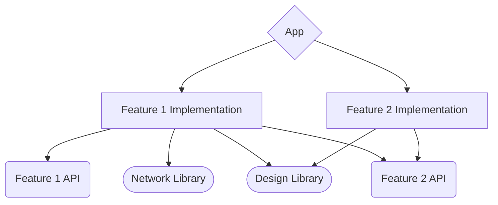

# PLAM
[](https://plugins.gradle.org/plugin/io.github.pwssv67.plam)

PLAM - PLugin for Android Modularisation, simplifying architectural tasks and verifying dependencies between different module types.

## Easy to use

If you are just starting a new project, that's all build script code you will need:
```kotlin
//project build.gradle.kts
import com.pwssv67.plam.*

plugins {
    id("com.android.application") version "8.0.0" apply false
    id("org.jetbrains.kotlin.android") version "1.8.10" apply false
    id("com.android.library") version "8.0.0" apply false
    id("io.github.pwssv67.plam") version "0.3.0" apply false
}

plam {
    appConfig {
        namespace = "com.sample.app"
        compileSdk = 33

        defaultConfig {
            applicationId = "com.sample.app"
            minSdk = 26
        }
    }
}

//app build.gradle.kts
import com.pwssv67.plam.*

androidApp(
    dependencies = listOf( //possible list of dependencies
        impl("androidx.core:core-ktx:1.10.1"),
        impl("androidx.lifecycle:lifecycle-runtime-ktx:2.6.1"),
    ) + listOf(
        testImpl("junit:junit:4.13.2")
    )
)
```

## Keeping track of module types
There are currently four module types:
* App - for app itself, as build endpoint, accumulating all other dependencies. Can be used only in other **Apps**. Can use anything.
* FeatureAPI - feature API or signature, like starting params needed for feature. Has the same role as an interface to an actual implementation: for dependency inversion. Can use only **libraries**.
* FeatureImpl - feature actual implementation. Can only be used in **App** module. Can use other **feature's APIs** and **libraries**
* Library - widely used code, like network requests, design components, etc. Can be added to any module.

## Dependency type check before builds
It analyzes the declared dependencies between modules and validates whether they comply with these predefined rules.
If a module attempts to declare an unsupported dependency, the plugin will automatically fail the build and provide clear error messages to help you identify and resolve the issue.

## Minimal boilerplate
You can write all common configuration code once, in root `build.gradle.kts`, and only change necessary parts for each module (like namespace or IDs)
### 
```kotlin
//root build.gradle.kts
plam {
    appConfig {
        namespace = "com.sample"
        compileSdk = 33

        defaultConfig {
            applicationId = "com.sample"
            minSdk = 26
        }
    }
}

//App1 build.gradle.kts
androidApp(
    dependencies = listOf(/*Dependencies*/)
) {
    defaultConfig {
        applicationId += "App1"
    }
}

//App2 build.gradle.kts
androidApp(
    dependencies = listOf(/*Dependencies*/)
) {
    defaultConfig {
        applicationId += "App2"
    }
}
```

### Typical module structure

*For the sake of simplicity, App's dependencies to features' APIs are omitted.*

## Use Samples
[Sample project](https://github.com/pwssv67/PLAM/tree/main/samples/simple%20modular%20project)
