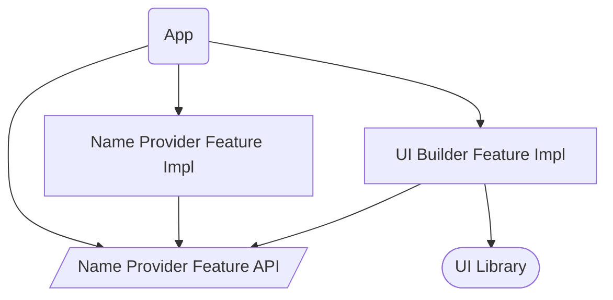

# Sample Android project with PALM

## Modules structure

```mermaid
flowchart TD
    A(App)
    B([UI Library])
    C[/Name Provider Feature API/]
    D[Name Provider Feature Impl]
    E[UI Builder Feature Impl]

    A --> C
    A --> D --> C 
    A --> E --> C & B 
```